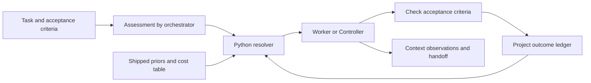

# Project assessment, 2026-09-17

## Conclusion and scope

This is an evidence-led research beta for Claude Code worker routing, with
a reusable installation bundle and a separate structured reasoning Controller.
It has useful measurements, reproducible generators and unusually explicit
limitations. It has not established a general cost or quality advantage on
real development work. Three reproduced accounting/learning defects make
unattended adaptive routing premature; the Controller budget is not a hard
aggregate spending limit.

Reviewed checkout: `v1.0-beta`, HEAD `4fb4682`. The initial tracked tree was
clean; `.codex/` was already untracked and was left unchanged. Review covered
the project charter, current and historical plans, evidence summaries and
selected result files, routing and handoff implementation, Controller state
machine and subprocess boundary, generators, schemas, consumer configuration
and offline harness. Historical paid experiments were inspected, not rerun.
This is not a claim that every historical transcript was independently audited.

## 1. Deliverables

| Deliverable | Source and purpose |
| :--- | :--- |
| Installable Claude Code bundle | `dist/`: 15 worker definitions, orchestration instructions, lifecycle rules, status command, settings fragment, preflight checker, scripts and schemas |
| Routing policy and local adaptation | `src/ROUTING.md`, three routing/cost JSON files, `tools/route.py`: assess a task, choose an allowed worker, record outcomes and adjust future choices |
| Structured problem-solving Controller | `tools/system_controller.py`, `src/System/`: bounded phases, six roles, a schema-validated record ledger, budget records, digests and `REPORT.md` |
| Context and session continuity | `tools/context_probe.py`, `tools/handoff.py`, lifecycle hooks: observe context, record pending workers, recover after compaction and transfer concise state |
| Evaluation apparatus | `test/harness/`, 18 routing fixtures, 15 benchmark task directories, historical results and their index |
| Engineering knowledge | Decisions, findings, premises, costs, frontiers, completed plans and generated persona profiles |

The product is currently a local developer workflow. There is no deployed
web application, cloud control plane, multi-tenant service or graphical UI in
the reviewed tracked tree. Graft is local indexing support, not the routing
product. Cloud infrastructure would add cost before establishing a user need.

## 2. How it works

The build generates workers from one persona and the configured model/effort
matrix: sonnet, opus and fable, each at low, medium, high, xhigh and max.
`build_dist.py` assembles the consumer bundle after the offline checks pass.
It strips marked rationale from the routing instructions to reduce a measured
classification bias caused by showing the assessor desirable destinations.



The assessment records sensitivity, horizon, blast radius, self-direction and
prior failure. Eighteen sensitivity/horizon/blast buckets have Beta priors.
`self_directed` is retained but unused for resolution; `prior_failure` does
affect the explicit frontier path. The normal empty-ledger choice is
`worker-sonnet-low`; open, consequential work instead selects the Controller
under an explicitly unmeasured risk policy. The resolver can promote another
active rung when its estimated pass rate clears the configured threshold.

The Agent/Task tool selects a named definition, which supplies model and
effort. A pending record is written after spawning and completed with outcome,
cost and time. This is Bayesian bookkeeping over a JSONL file, not model
training. Recording is currently a behavioural obligation rather than an
enforced transaction. Labels are supplied by the orchestrator, so an unnoticed
wrong answer can teach the router the wrong lesson.

The Controller separately invokes `claude -p` for framing, premise verification,
candidate generation, critique, selection and library recording. Python owns
the phase transitions and record validation. Candidate generation can run
concurrently; a single Scribe assigns record IDs and writes validated records.
It is invoked for falsified-constraint cases, escalation, or the proactive
policy/cost rule. The normal workflow then applies its recommendation through
a worker. Schema validity establishes record shape, not factual correctness.

Context hooks write the main session and worker observations separately.
The resolver can advise task decomposition or a fresh-session handoff.
Recovery hooks list pending work and the newest handoff after compaction.
Worker observation remains partly dependent on version-sensitive Claude Code
behaviour. These Claude mechanisms are not automatically Codex integrations.

## 3. Assessment

### What is sound

- Code resolves the routing decision rather than asking a second model to
  improvise it. Shared generators and drift checks reduce configuration skew.
- Decisions distinguish measured evidence, policy and unknowns. Negative
  experiments have changed the design rather than being hidden.
- The Controller's single-writer Scribe and record ownership checks provide
  useful boundaries between model output and programme state.
- Fake role runners, replay, backtests and offline selftests allow substantial
  verification without paid calls. Handoff shape and provenance are checked.
- The measured decomposition result is promising: on one shape, failures
  fell from 11/12 to 0/12. This supports testing decomposition further, not
  assuming the same result for arbitrary tasks.

### What the evidence establishes

The historical T1-T11 measurements put ten tasks at the cheapest tested cell.
T10 needed a different approach/cell. Repeated successes on a few authored
tasks are evidence about those tasks, not a representative production sample.
The project's nine-success reporting bar has a Wilson lower bound of about
0.70. That is a defensible exploratory convention, not a reliability target
for consequential production changes.

The repository reports routing overhead roughly equal to a floor task and
the Controller at 10.8 times floor cost per solved T10 task, with only six
of nine Controller runs finishing. A rational product objective is therefore
minimum total cost per independently accepted task, including verification,
retry, routing, cold context, incomplete attempts and operator time.
Neither broad cost savings nor improved production safety is established.
The audit trail may be useful, but its value still needs measurement.

### Findings requiring action

| ID | Priority | Evidence and consequence | Proposed correction |
| :--- | :--- | :--- | :--- |
| R1 | High | `route.py:ledger_cell_means` includes pending records. Five zero-cost pending rows replace the floor's measured cost/time with 0/0. Reproduced offline. | Separate pending/completed status and unknown/zero measurements; use only eligible observations for each cost/time mean. |
| R2 | High | `posterior` counts first-cell results only for sonnet-low; other cells learn only through escalation entries. Twenty direct opus-high failures leave its mean at 0.9 with zero recorded failures. Reproduced offline. | Track every attempt, distinguishing direct-start performance from performance conditional on cheaper cells failing. Do not simply mix those populations. |
| R3 | High | `LiveRoleRunner` gives each role USD 2 even with USD 0.60 remaining. Reproduced with a mocked subprocess call. Concurrent generators see the same unreserved balance; failed calls can lose spend metadata at the exception boundary. | Reserve budget before dispatch, bound each call by its reservation, reconcile actual usage including aborted calls, and document provider overshoot limits. |
| R4 | High before economic tuning | `ledger_cell_means` divides a task's total evenly across all attempted cells. A USD 0.10 floor attempt followed by USD 1.90 escalation becomes USD 1.00 for each. | Record per-attempt token categories, cost, duration, model identity, result and validation evidence. Keep unknown allocation unknown. |
| R5 | Medium | `plan` can select opus-high first but its projection still sums the full ladder from sonnet-low. Twenty recorded floor failures reproduced a USD 0.7979 projection despite selecting a USD 0.9217 starting cell. Controller comparisons also omit a measured Controller failure/retry term and use the cost of completed runs. | Price the policy that will execute and include completion probability, failed-attempt spend and verification cost on both sides. |
| R6 | Medium, concurrency limitation | `complete_ledger_entry` replaces the whole JSONL file using a shared `.tmp` name; `next_ledger_id` reads then increments without locking. The schema assumes one writer. | Enforce one writer across sessions or add transactional storage/locking before parallel sessions share a project ledger. Atomic replacement alone does not prevent lost updates. This is a code-inspection risk, not a measured production incident. |
| R7 | Medium | Outcome recording can be skipped; success has no independent evidence requirement; old model/task regimes never expire. | Reconcile pending attempts, require acceptance evidence, and retain model/build identities plus a deliberate recency policy. |
| R8 | Medium | Static checks validate many document assertions and prior results, not current platform behaviour. The routing fixtures largely encode the selected floor policy. | Add targeted failure and accounting checks; keep compatibility probes and held-out real-task evaluation separate from policy regression tests. |
| R9 | Low | README still says 31 checks and a permanent skip, no results index, seven handoffs and eighty decisions. Inspected state had 33 checks, an index, eight handoffs and D83. `SELF-LEARNING.md` also says two assessment fields are unused although `prior_failure` selects a frontier. | Generate small status facts or maintain one canonical status summary; mark historical claims by date. |

Additional design limits: fixed `COST_ORDER` is not a learned cost ordering;
the current means pool different task difficulties; no model-version partition
protects learned outcomes from alias changes; the full ledger is read each
time; and the persona generator is absent from this repository. None of these
requires a large framework, but they constrain claims of adaptation,
reproducibility and scale.

## 4. Status and verification

Plans 1-6 are recorded complete; Plan 6 closes the earlier 63-finding audit
through D83. HEAD adds the self-learning description. The historical final
harness result is 33 passes, zero failures and zero skips. The incoming bundle
has 49 files matching its generated content, but its stamp is
`2026-09-17-1dd7f03-dirty`. Source equivalence passed; clean release provenance
was not established by that stamp.

The first fresh run in this review produced 32 passes and one failure:
`COMPACT-BENCH-SELFTEST` reached a permission-blocked `python3` uv launcher.
The bundled Python works. Git also initially rejected the checkout ownership;
a process-scoped safe-directory setting permits inspection without changing
global Git configuration. An isolated temporary Bash environment supplies the
working Python to shell graders. Final validation is recorded below after
the consumer instructions are rebuilt.

Reproductions use imports and mocks, with no API calls:

```python
import sys
from pathlib import Path
from unittest.mock import patch
sys.path.insert(0, "tools")
import route, claudep, system_controller as sc

pending = [dict(first_cell="worker-sonnet-low", final_outcome="unknown",
                cost_usd=0, wall_clock_s=0) for _ in range(5)]
assert route.ledger_cell_means(pending, 5)["worker-sonnet-low"]["cost_per_run_usd"] == 0
bucket = "mechanical/short/contained"
failed = [dict(bucket=bucket, first_cell="worker-opus-high",
               final_outcome="fail", escalations=[]) for _ in range(20)]
post = route.posterior(route.load_priors(), failed, bucket)
assert post["rungs"]["worker-opus-high"]["ledger_fails"] == 0
reply = claudep.ClaudeCallResult("", 0, 0, {}, {}, "fake")
with patch.object(claudep, "call_claude", return_value=reply) as call:
    sc.LiveRoleRunner(Path("."), lambda: 0.60)("frame", "framer", "test", timeout=1)
    assert call.call_args.kwargs["max_budget_usd"] == 2.0
```

These assertions demonstrate defects in the reviewed version; they are not
desired-behaviour regression tests. Runtime fixes are proposed, not included
in this assessment task.

## 5. Recommended sequence

1. Correct R1-R5 before tuning routing thresholds. Start with failing tests
   for missing measurements, elevated first-cell outcomes and budget
   reservation. Introduce a small versioned attempt record rather than more
   heuristics over task totals. Expected engineering time: 1-3 working days,
   an estimate including schema migration and verification.
2. Enforce recording and isolate concurrent writers. Add a single diagnostic
   summary showing unresolved attempts, evidence freshness, actual model,
   cost confidence and acceptance evidence. Expected time: 1-2 days after
   the attempt record exists.
3. Compare three frozen policies on held-out real tasks: cheapest worker
   plus verification/escalation; adaptive routing; Controller on a narrow,
   explicitly defined subset. Charge all failures and human review. Define
   a practical quality target before increasing sample size. Plan 3-5 days
   for preparation/review; API spend depends on the selected tasks and must
   be projected separately before execution.
4. Reduce recurring context. Keep a short charter and load topic-specific
   evidence only when needed. Measure prefix reuse, cache writes/reads,
   latency and quality before changing TTL or introducing more model switches.
   Preserve stable prompt prefixes. Expected time: 0.5-1 day for instrumentation,
   followed by a separately budgeted comparison.
5. Make installation reversible and repeatable: merge configuration safely,
   show a dry-run diff, test a clean install, add CI for the offline suite,
   and define a clean versioned release and licence if distribution is intended.
   Expected time: 1-2 days. Keep a concise default CLI, with detailed diagnostics
   behind an explain option; a dashboard can wait for demonstrated demand.

These ranges are planning judgement, not measured delivery times. No paid
benchmark budget was consumed during this review. This session's own billing
cannot be inferred from subprocess spend.

Current official pricing separates input, output and cache categories; rates
and cache behaviour must be recorded per provider/model, not inferred from a
historical family average. See [OpenAI pricing](https://developers.openai.com/api/docs/pricing)
and [Anthropic pricing](https://platform.claude.com/docs/en/about-claude/pricing),
checked 2026-09-17. Claude Code documents model switches as losing cache reuse
on the next request; a compact handoff can reduce the transferred context,
but fresh sessions still have a cold-start cost. See
[Claude Code caching](https://code.claude.com/docs/en/prompt-caching).

## Changes made for the operator's standing requirements

Added a Codex-readable root `AGENTS.md`; updated `CLAUDE.md`,
`src/CLAUDE.template.md` and `src/LIFECYCLE.md`. Every agent/subagent launch,
fresh session, model change or effort change now requires a concise checked
handoff and an operator notice with target settings, cost and time ranges.
The contract separates session API-equivalent cost from measured experiment
subtotals, requires pricing/cache assumptions, and forbids treating unknown
usage as free. New consumer projects inherit it through the rebuilt bundle;
existing installed projects need the updated template/lifecycle merged.

This is a persistent instruction policy. It is not a new runtime hook that
can guarantee every future agent obeys it. `handoff.py check` still validates
structure and its computed subtotals, not the truth of every prose estimate.
No model switch or subagent was needed for this review.

Final validation: `tools/build_dist.py` completed through its normal harness
gate; the rebuilt 49-file bundle is stamped `2026-09-17-4fb4682-dirty` because
this review's changes are uncommitted. `test/harness/check.py --json` then
returned **33 pass, 0 fail, 0 skip**. Full output is saved in
`docs/ASSESSMENT-2026-09-17-checks.json`. `git diff --check` passed.
The bundled Python 3.12.14 runtime and temporary `BASH_ENV` shim were needed
for the shell grader; the default `python3` launcher remains blocked in this
sandbox. The shim and Git ownership exception were process-scoped; user
configuration was not changed. Passing these checks does not resolve R1-R8
or establish current live model behaviour. Runtime code was not modified.
